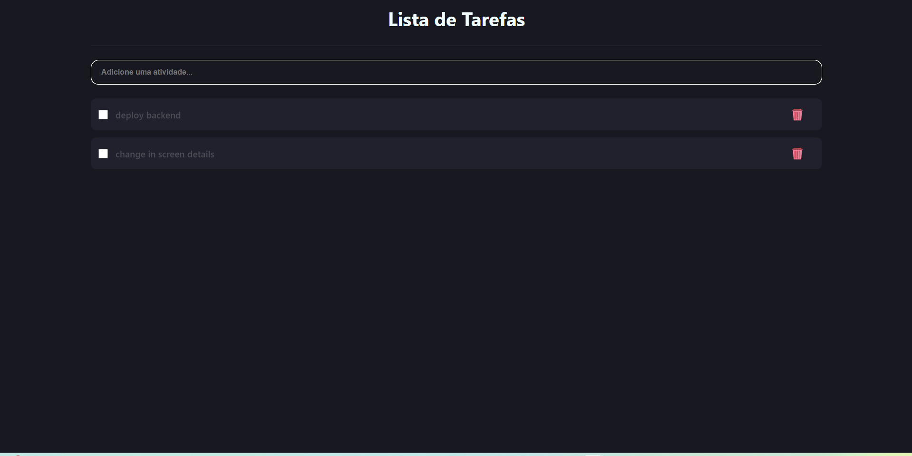
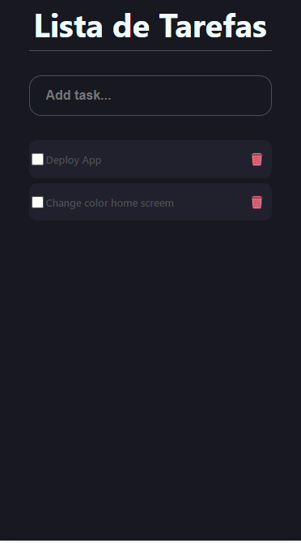

# To-do List 📚

## Getting Started ⚙️

- Clone this repository
- Install packages: `npm install`.
- Run project: `npm start`

## About 🎯

- This project aims to create a to-do list to deepen knowledge in React.

- Images of application

- Responsive Layout

